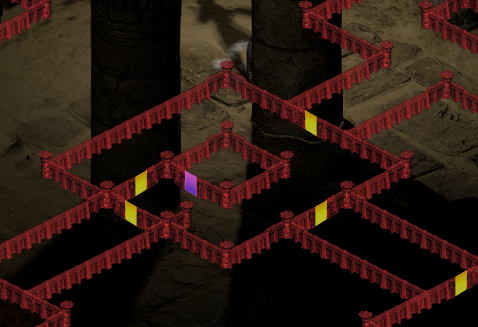
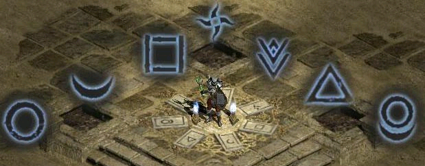
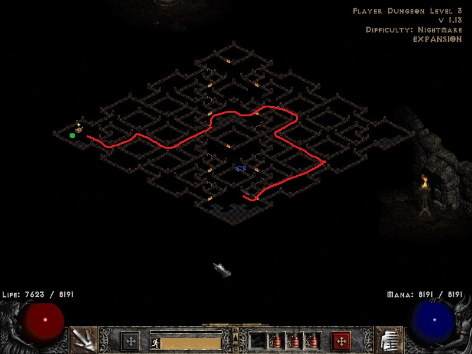
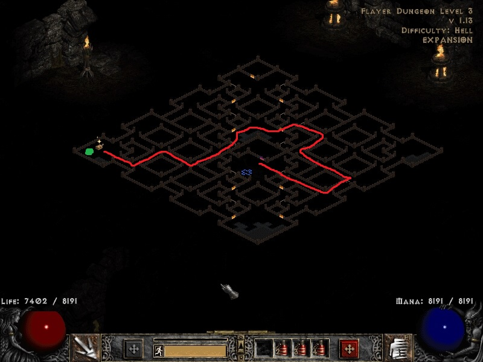
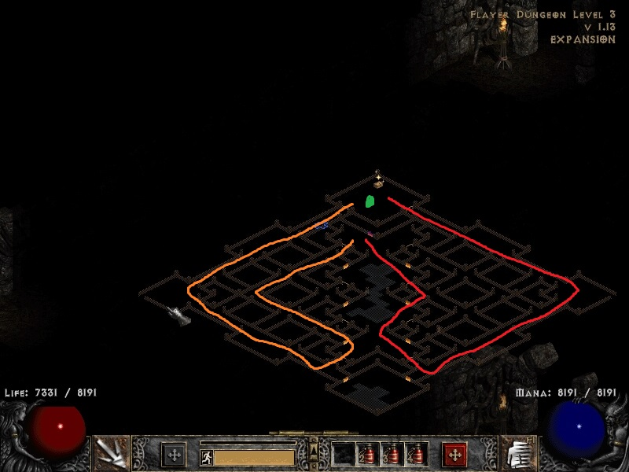
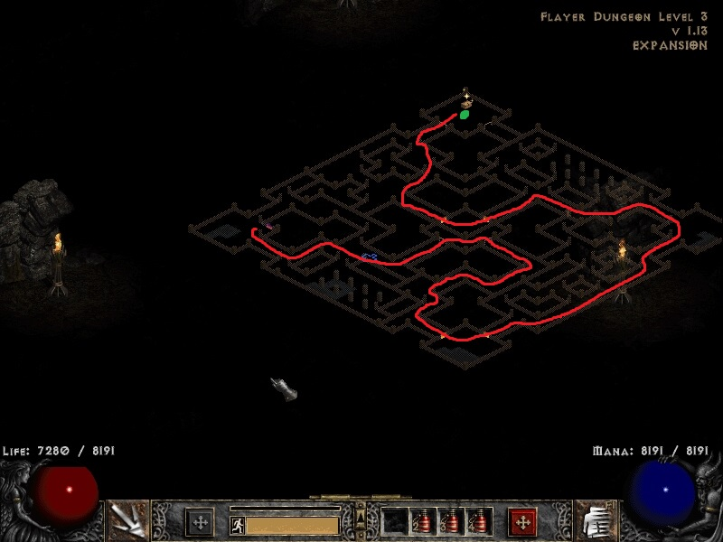
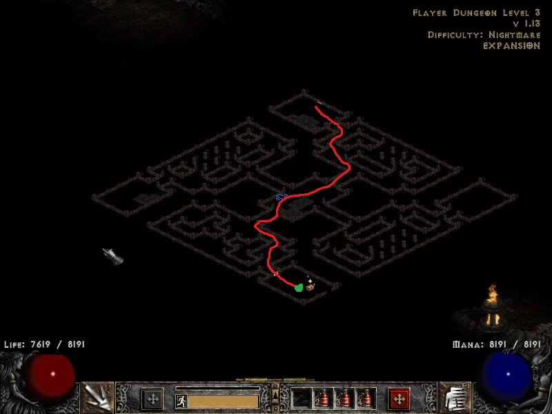
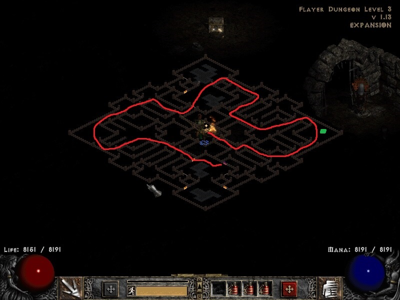

import A1FilterTable from '@site/src/components/A1FilterTable';

# A1 to A4 Notes

## Random level notes (assassin only)

- 2 before cold plains
- 3: 1 point into claw mastery
- 6: 1 point into burst of speed
- 8-12: trist pub games or countess run
- 17: equip stealth + frw circlet
- 19: equip leaf

## Look for these items
- ilvl 20 amulet/cirlet/pelts for + ele skill druid
- ilvl 18 belts/body armor for 24% FHR
- ilvl 1 rare jewel of envy
- ilvl 5 rare jewel of joyfulness
- ilvl 12 circlet of pacing (10% FRW)
- https://diablo2.io/forums/post-your-twink-gear-setup-t1481448.html
- https://www.reddit.com/r/ProjectDiablo2/comments/nguqj2/an_item_find_guide_to_low_level_duels_clvl_130/

## Skill / Stats

- str -> 30
- 10 to energy
- rest to vit

## Acts

### A1

**ideal bottom left start in town**
<A1FilterTable />

- **Barrack**: left/straight
- **Jail 1 + 2**:           straight
- **Jail 3**:                left
- **Cata 2 to 3 from wp**:   right
- *buy antidote for andy*

### A2

- **A2**: hug walls                        
- **Hall of Dead**: left                             
- **Maggot Lair 1 + 2**: right                            
- **Maggot Lair 3**: straight (always top right)      
- **Claw Viper Temple 1**: left (the part without any path is the back. left facing the front)
-  
- **Tal Rashas Tomb**: left 
- 
- *buy thaw potion for duriel*

### A3

- *jungle is always 2x6 blocks; if great marsh at block 6 then not skippable*
- **Flayer Dungeon 1 + 2**: left
- **Flayer Dungeon 3**:
-      
- **Durance 1**: left
- **Durance 2**: straight

### A4

- **River of Flames**: left on incomplete H
- *use Antler with cyclone armor for Diablo*