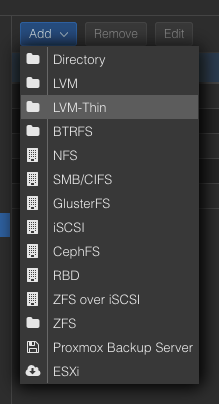
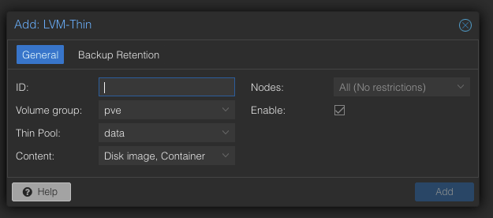

When adding new node to a cluster, also need to add the local storage to the cluster (limited to the new node).

Open up Proxmox web interface in the new node, then under Datacenter -> Storage -> Add:

- ID needs to be unique to the cluster
- Nodes should be restricted to the new node if this is a local storage